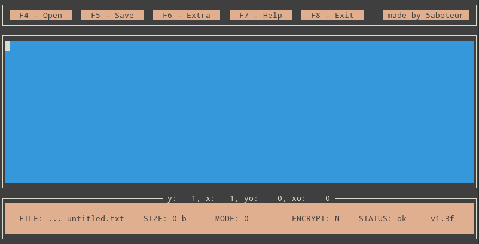
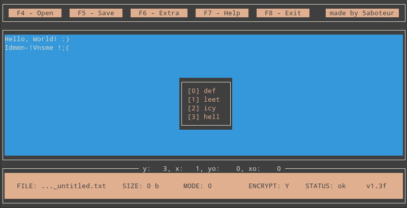
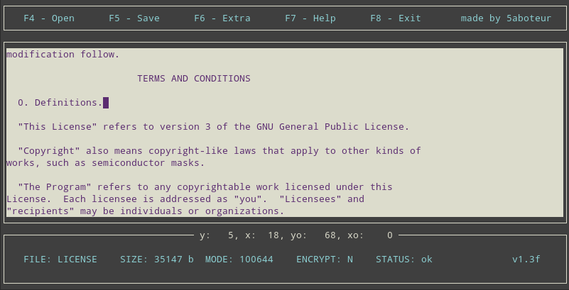

# YATE

## Overview

YATE (Yet Another Text Editor) – is a text editor, built for education purposes. It's written in C language and uses ncurses library to provide the simple graphical user interface. YATE was made in 2018 to pass the Eltex courses.

The basic launch of the program looks something like this:

Here we have 3 sections of the program. The upper section has all YATE options and you should press an appropriate function key to get one of them. All of the options also have the "control key combo" analogues, so if we want to open the file, we can press `F4` button or use `CTRL+O` shortcut. YATE also has some extra features. For example, if we want to change the current theme, we can use `CTRL+G` combination.

The middle section contains nothing but a text that you wrote down or that you loaded from the file. The bottom one displays some useful _(or not so?)_ information about the file and current state of the editor (e.g. is live encryption enabled, does an error occurred, app version etc).

## Features

* An ability to create / update / delete files
* Live xor encryption
* Four different themes

## Control keys & Shortcuts

| Key | Shortcut | Description     |
|-----|----------|-----------------|
|  F4 |  CTRL+O  | open file       |
|  F5 |  CTRL+S  | save file       |
|  F6 |  CTRL+E  | extra options   |
|  F7 |  CTRL+F  | get help        |
|  F8 |  CTRL+X  | exit            |
|  –  |  CTRL+Y  | live encryption |
|  –  |  CTRL+G  | change theme    |
